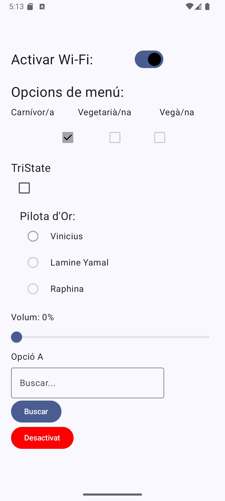
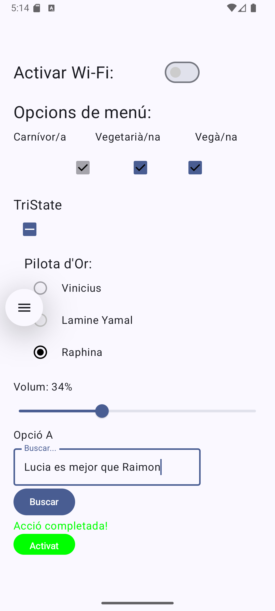
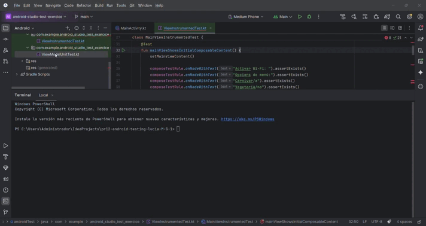
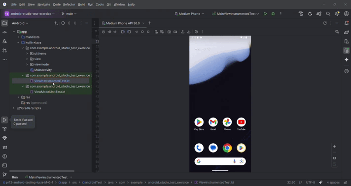

# Android Testing: Unit Testing + Instrumental Testing

### 🤍 Objectiu de l'activitat
Partint de la base del repositori donat, completada l’aplicació d’Android per tal de que segueixi el patró MVVM i dissenyat els tests de Unit Testing per a tots els mètodes del ViewModel i de Instrumental UI Testing per a tots els Composables de la MainView.

Parts de la MainView i del MainViewModel completades.

### 🤍 Requisits de l'activitat
#### 1. Treball individual

#### 2. Entorn de desenvolupament
- **Android Studio** (versió *Ladybug*)
- **Kotlin** amb **Jetpack Compose**

#### 3. Arquitectura
- Patró **MVVM**
- **LiveData** per gestionar dades reactives per subscripció

#### 4. Llibreries
- Gestió de dependències a:
  
  ```
  build.gradle.kts (Module: app)
  ```
  
#### 5. No es pot canviar el comportament de l’aplicació ni el disseny original de la MainView

### 🤍 Implementació MVVM
L'aplicació segueix el patró MVVM separant la pantalla principal en:
- `MainView`: composable encarregat de mostrar la interfície i enviar accions de l'usuari al ViewModel.
- `MainViewModel`: classe que manté l'estat de la pantalla amb `LiveData` i exposa mètodes públics per modificar-lo.

### 🤍 Procés de Testing
#### Unit Testing
Els unit tests es troben a:
```text
app/src/test/java/com/example/android_studio_test_exercice/ViewModelUnitTest.kt
```

Aquests tests validen:
- Estat inicial del `MainViewModel`.
- Tots els mètodes de canvi d'estat: switches, checkboxes, tristate, radio button, slider, dropdown, text field, snackbar i botó final.
- Execució síncrona de `LiveData` amb `InstantTaskExecutorRule`.

#### Instrumental UI Testing
Els tests instrumentals de Compose es troben a:

```text
app/src/androidTest/java/com/example/android_studio_test_exercice/ViewInstrumentedTest.kt
```

Aquests tests validen:
- Renderitzat dels textos i composables principals de `MainView`.
- Interacció amb `Switch`, `Checkbox`, `TriStateCheckbox`, `RadioButton`, `Slider`, `DropdownMenu`, `OutlinedTextField` i `Button`.
- Actualització visual després de modificar l'estat des de la UI.

#### "Demo"

|                Estat 1 de la app                |                 Estat 2 de la app                |
| :------------------------------------------: | :---------------------------------------: |
|  |  |

|                UnitTest                |                 InstrumentalTest                |
| :------------------------------------------: | :---------------------------------------: |
|  |  |
